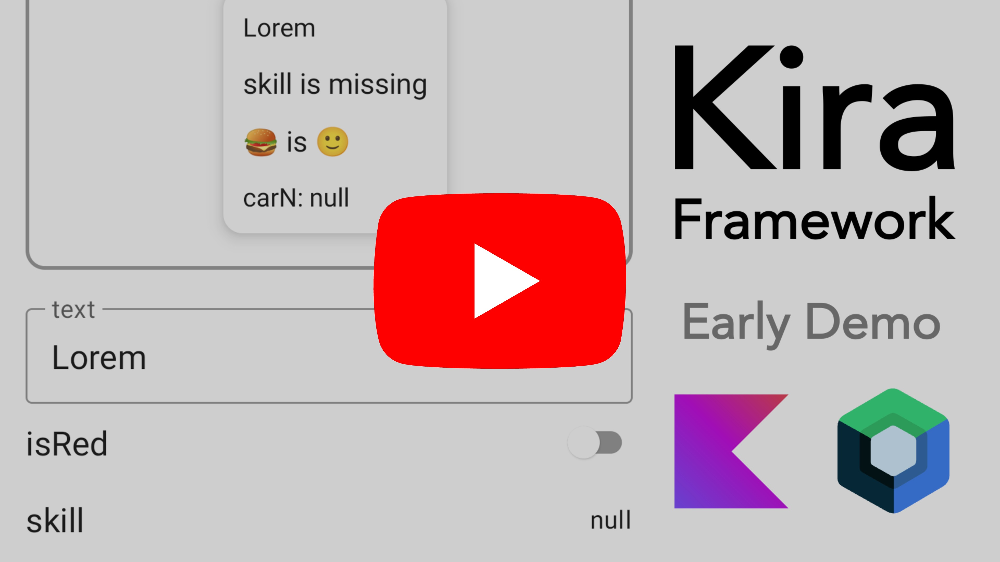

# Kira  [Work in progress 🚧]

[](https://www.repostatus.org/#suspended)
[](https://developer.android.com/jetpack/androidx/releases/compose-foundation#1.2.0)

Kira is an Android library that defines a Kotlin DSL (similar to 
[androidx.preference](https://developer.android.com/guide/topics/ui/settings)) for creating UI that allows users to call
any function (including `@Composable` ones) with any parameter values.

Kira also includes annotation-processor `kira-processor` that __✨automagically✨__ generates UI for functions using the 
DSL.

Library is particularly useful for building demo screens for UI components in playground apps of various design systems.

## Example

```kotlin
@Kira
@Composable
fun TextCard(
    text: String,
    isRed: Boolean,
    skill: Skill?,
    food: Food,
) = TODO()
```

Generated code (only a portion):

```kotlin
kira(TextCardScope()) {
    text = string(paramName = "text", defaultValue = "Lorem")
    isRed = boolean(paramName = "isRed", defaultValue = false)
    skill = nullableEnum(paramName = "skill", defaultValue = null)
    food = enum(paramName = "food")
    injector {
        TextCard(
            text = text.currentValue(),
            isRed = isRed.currentValue(),
            skill = skill.currentValue(),
            food = food.currentValue(),
        )
    }
}
```

Screenshot of the UI demo screen:


## Demo Video

<a href="https://www.youtube.com/watch?v=FOiUPHJNiYI" target="_blank">
    
</a>

## Getting Started

[](https://jitpack.io/#popovanton0/kira)

Add the following code to your project's _root_ `build.gradle` file:

```groovy
repositories {
    maven { url "https://jitpack.io" }
}
```

Next, add the dependency below to your _module_'s `build.gradle` file:

```gradle
dependencies {
    implementation "com.github.popovanton0:kira:LATEST_VERSION"
    ksp "com.github.popovanton0.kira:kira-processor:LATEST_VERSION"
}
```

## Usage

Examples are in
the [source code](https://github.com/popovanton0/kira/blob/master/app/src/main/java/com/popovanton0/kira/demo/MainActivity.kt)
.

### Basic

```kotlin
TODO()
```

<!-- No try-catch https://kotlinlang.slack.com/archives/CJLTWPH7S/p1603748877143100?thread_ts=1603737209.131700&cid=CJLTWPH7S -->

